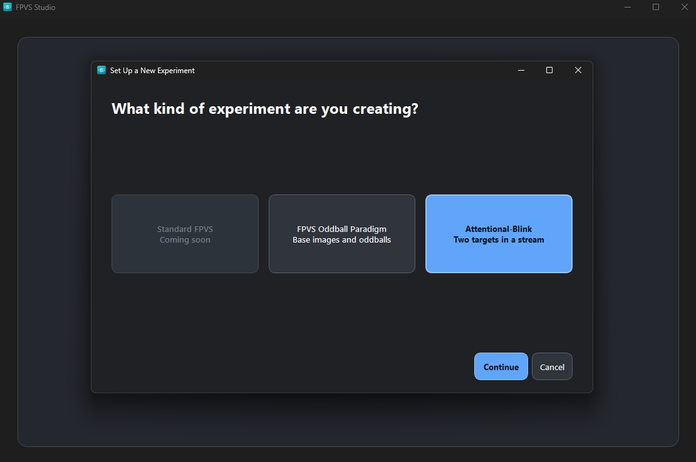
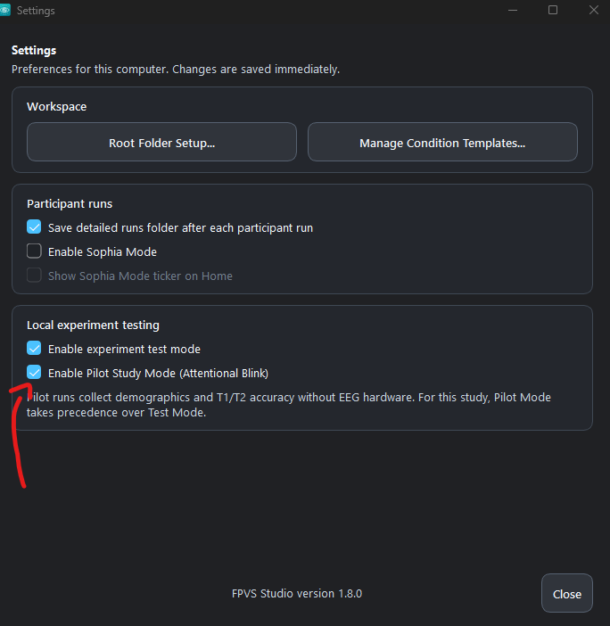

## About FPVS Studio

FPVS Studio was designed with the non-expert user in mind. It is a user-friendly software package that allows users to create and run FPVS experiments with zero coding knowledge required.

Once an experiment has been created, users simply need to open FPVS Studio, select their experiment, and run it. FPVS Studio logs all of the necessary information (eg., fixation cross accuracy, reaction times, image display seeds, etc) automatically, and outputs everything that is needed for a future publication. FPVS Studio is designed to work directly with the FPVS Toolbox - users can export their FPVS Studio project to be imported into FPVS Toolbox, which streamlines data analysis.

## Installation and first project {#getting-started}

This guide walks through installing FPVS Studio on Windows and creating a project. No Python installation or coding is needed. The examples show version 1.8.0; labels may change in later releases. FPVS Studio is beta software, so start with a practice project before collecting study data.

[Download FPVS Studio](https://github.com/zcm58/FPVS-Studio-2.0/releases){.btn .btn-primary target="_blank"}

[Read the user documentation](https://zcm58.github.io/FPVS-Studio-2.0/){target="_blank"}

### 1. Download and install

1. Open the [GitHub releases page](https://github.com/zcm58/FPVS-Studio-2.0/releases){target="_blank"}, find the most recent release marked **Latest**, and expand its **Assets** if needed.
2. Download that release's Windows installer whose name begins with **FPVS-Studio-Setup** and ends in **.exe**. The version number in the filename changes with each release. The source-code ZIP is not the installer.
3. Open the downloaded installer and follow its prompts. Then launch **FPVS Studio** from the Start menu or desktop shortcut.

**If Windows or your browser shows a warning:** first check that the file came from the **zcm58/FPVS-Studio-2.0** release page above. A browser may offer **Keep** or **Keep anyway**; Windows SmartScreen may offer **More info → Run anyway**. Only continue if you have verified the source and intend to trust the download. If your institution blocks installation, ask its IT team for help.

### 2. Choose a root folder

On first launch, choose an **FPVS Studio Root Folder**. This is the main folder where the app stores your projects and shared templates; each experiment has its own project folder inside it.

Create a folder named **FPVS Studio** somewhere you can easily find again. A local folder outside OneDrive or another cloud-sync service is recommended, because syncing can interfere with loading or running experiments. Select that folder to finish the initial setup.

You can change this location later using **Change Root Folder…** on the welcome screen or **File → Settings → Root Folder Setup…**.

### 3. Create a project

From the welcome screen, select **Create Project**, choose an experiment family, and click **Continue**.

- **FPVS Oddball Paradigm:** use this for an experiment with frequent base stimuli and less frequent oddball stimuli. For an image-based project, prepare the image folders in the next step.
- **Attentional-Blink:** use this for two targets presented within a rapid stream. The five-second digit-recall template uses letters and digits, so it does not need base and oddball image folders.

{fig-alt="FPVS Studio experiment chooser with FPVS Oddball Paradigm and Attentional-Blink options and a Continue button. Standard FPVS is marked Coming soon." width=800 loading="lazy"}

Give the project a descriptive name, such as **Practice FPVS Project**, choose the appropriate experiment template, and check the save location. Click **Create Experiment**, then follow the setup steps for your chosen family.

### 4. Select your images

For an image-based oddball project, put the frequent **base images** in one folder and the less frequent **oddball images** in another. Use a separate pair of folders for each condition when the stimulus sets differ. For example:

```{.text #stimulus-folder-example}
Practice Stimuli/
  Base Images/
    base-01.png
    base-02.png
  Oddball Images/
    oddball-01.png
    oddball-02.png
```

In the **Conditions** step, name your condition and select its base and oddball image folders. Check that each folder contains the intended images before continuing.

Use square images with consistent dimensions and file type; PNG is a good starting point. For example, prepare all images at **512 × 512 pixels**. The built-in **Tools → Image Resizer** can create resized PNG copies. Select the output folders when setting up the condition. Image file dimensions and the size displayed on screen are separate settings.

For more detail, see the [stimulus preparation guide](https://zcm58.github.io/FPVS-Studio-2.0/prepare-images/){target="_blank"}.

### 5. Review the experiment and try it

Work through the remaining setup screens. Check your conditions, timing, display settings, repetitions, and any fixation or response task before saving. Use settings appropriate to your study and display rather than assuming the template defaults match your design.

Return to **Home** and choose **Launch Experiment** for a practice run. Follow the participant and start prompts, then check that the stimuli and responses behave as expected. Run outputs are stored in the project's **runs** folder, with project run history under **logs**.

#### Attentional Blink without EEG hardware

For an Attentional Blink pilot, open **File → Settings**, enable **Enable Pilot Study Mode (Attentional Blink)**, and click **Close**. Settings save immediately. This mode collects demographics and T1/T2 accuracy without EEG hardware and takes precedence over experiment test mode. It applies to Attentional Blink, not image-based FPVS experiments.

{fig-alt="FPVS Studio Settings with Enable Pilot Study Mode (Attentional Blink) checked. The description explains that pilot runs collect demographics and T1/T2 accuracy without EEG hardware." width=620 loading="lazy"}

### 6. Reopen your project

The next time you launch FPVS Studio, choose **Open Existing Project** on the welcome screen and select the project you created. You do not need to repeat installation or create the experiment again.

## Updates and bug reports

Use **File → Check for Updates** to look for a newer version. You can also return to the [GitHub releases page](https://github.com/zcm58/FPVS-Studio-2.0/releases){target="_blank"} for installers and release notes.

If something goes wrong, choose **File → Report a Bug…**. Include what you were trying to do, what happened, your FPVS Studio version, and the steps needed to reproduce the problem. Review any attached information before submitting, and leave participant-identifying information out of the report.
