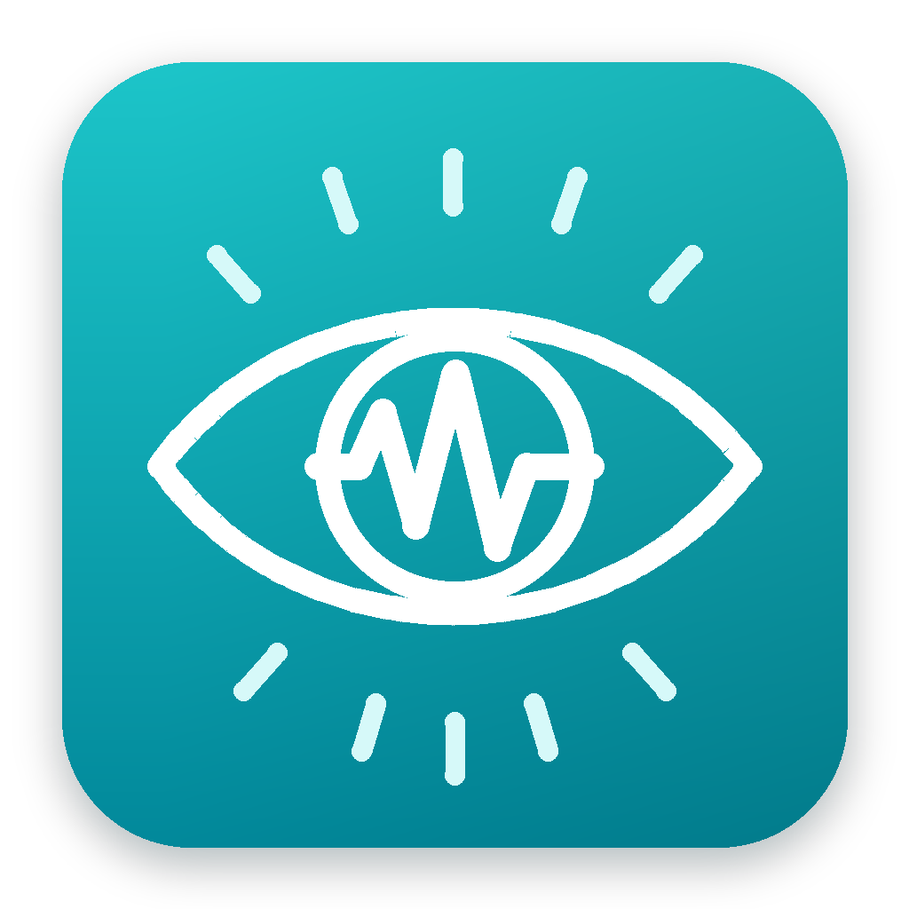

## About FPVS Studio

After spending many weeks during each semester teaching my undergraduate students basic programming concepts just to be able to understand how to run FPVS experiments, the concept of the FPVS Studio was born. The idea was to create a user-friendly interface that would allow students to easily set up and run their FPVS experiments without needing to dive into complex programming.

FPVS Studio was therefore designed with the non-expert undergraduate user in mind. The user interface is simple and intuitive, and in practice, my students have found it much easier to use compared with python or PsychoPy for this specific task. I have built in many of the default options commonly used in FPVS experiments, and the setup wizard guides users through the process of creating their experiment step by step.

Once an experiment has been created, users simply need to open FPVS Studio, select their experiment, and run it. FPVS Studio logs all of the necessary information (eg., fixation cross accuracy, reaction times, image display seeds, etc) automatically, and outputs everything that is needed for a future publication.

FPVS Studio is designed to work directly with the FPVS Toolbox - users can export their FPVS Studio project to be imported into FPVS Toolbox, which makes setting up this project for data analysis much easier.

All in all, FPVS Studio is a powerful tool that makes FPVS easily accessible to anyone with a computer.
