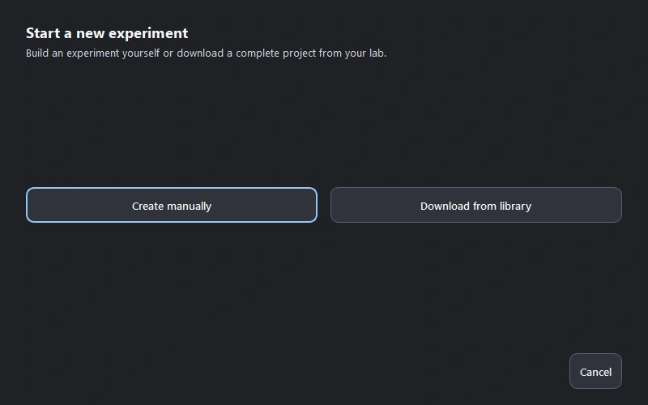
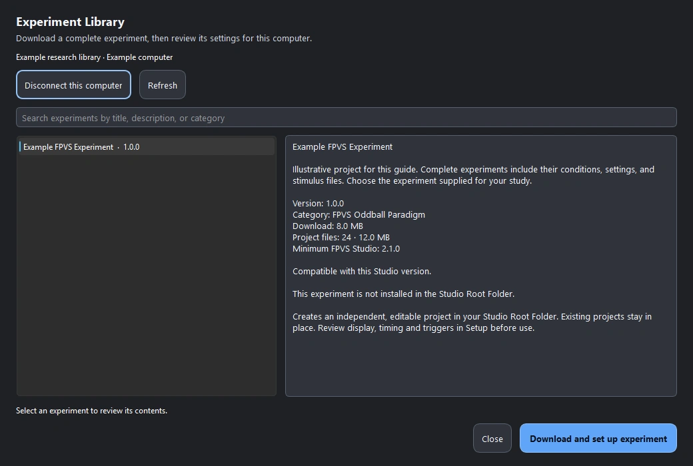
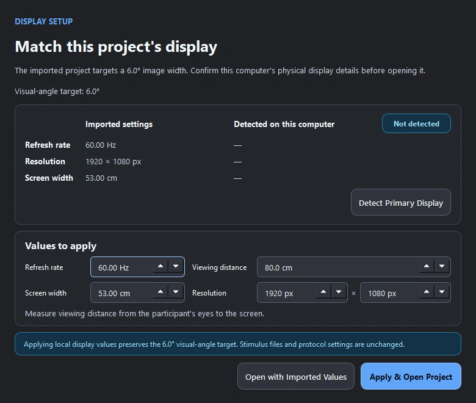
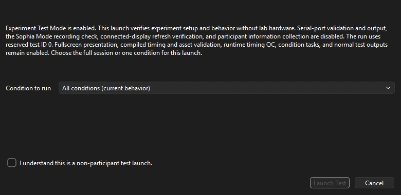

## About FPVS Studio

FPVS Studio was designed with the non-expert user in mind. It is a user-friendly software package that allows users to create and run FPVS experiments with zero coding knowledge required.

Once an experiment has been created, users simply need to open FPVS Studio, select their experiment, and run it. FPVS Studio logs all of the necessary information (eg., fixation cross accuracy, reaction times, image display seeds, etc) automatically, and outputs everything that is needed for a future publication. FPVS Studio is designed to work directly with the FPVS Toolbox - users can export their FPVS Studio project to be imported into FPVS Toolbox, which streamlines data analysis.

## Installation and Setup Guide

This guide walks through installing FPVS Studio on Windows 10/11 and setting up your first project. You can download a complete experiment from the Experiment Library or create your own. No Python installation or coding is required.

The screenshots show FPVS Studio 2.1.0 with illustrative project and display values. Click or tap a screenshot to enlarge it.

[Download FPVS Studio](https://github.com/zcm58/FPVS-Studio-2.0/releases){.btn .btn-primary target="_blank"}

### 1. Download and install

1. Open the [GitHub releases page](https://github.com/zcm58/FPVS-Studio-2.0/releases){target="_blank"}, find the most recent release marked **Latest**, and expand its **Assets** if needed.

2. Download the Windows installer whose name begins with **FPVS-Studio-Setup** and ends in **.exe**. You may also see patch files and source code archives; choose the installer for your first installation.

3. Open the downloaded installer and follow its prompts. Then launch **FPVS Studio** from the Start menu or desktop shortcut.

**If Windows or your browser shows a warning:** first check that the file came from the **zcm58/FPVS-Studio-2.0** release page above. A browser may offer **Keep** or **Keep anyway**; Windows SmartScreen may offer **More info → Run anyway**.

### 2. Choose a root folder

On first launch, choose an **FPVS Studio Root Folder**. FPVS Studio uses this root folder to store all of your projects and their data. I recommend creating a new folder for this purpose titled something like "FPVS Studio Root". I also recommend creating a folder that is NOT a cloud sync folder (like OneDrive, Google Drive, etc) as syncing can interfere with loading or running your experiments.

If needed, you can change this location later using **Change Root Folder…** on the welcome screen or **File → Settings → Root Folder Setup…**.

### 3. Choose how to create your project

From the welcome screen, select **Create Project**. You can then choose between two paths:

- [**Download from library**](#download-from-library) if your lab or collaborator has shared an experiment through the Experiment Library.
- [**Create manually**](#create-manually) if you want to build your own experiment and select your own stimuli.

{fig-alt="FPVS Studio project setup dialog with Create manually and Download from library buttons." width=800 loading="lazy"}

#### Download from the Experiment Library {#download-from-library}

The Experiment Library lets you download a complete experiment and set it up on another computer. Each download becomes a separate, editable project in your FPVS Studio Root Folder, including the experiment's bundled stimuli and settings.

1. Choose **Download from library**. If you already have a project open, you can also use **View → Experiment Library…**.

2. If prompted, enter the **Access code** provided by your lab or the library administrator, confirm the **Computer name**, and click **Connect**. If you don't have a code, ask the person sharing the experiment. You do not need a GitHub account. Access is remembered for your Windows user account on this computer.

3. Select the experiment you want to use. Review its description and minimum FPVS Studio version, then click **Download and set up experiment**. If it requires a newer version of FPVS Studio, update the app first.

4. Review the project details and destination folder, then click **Import Project**. Wait for FPVS Studio to finish setting up the local copy.

{fig-alt="Experiment Library with a sample experiment selected, its description and version requirements, and the Download and set up experiment button." width=800 loading="lazy"}

Your downloaded project already includes its bundled stimuli, so you can continue to [configure this computer's display](#configure-display). You only need the manual image-folder steps below if you are creating your own experiment or replacing its images. Once downloaded, your local project remains available offline.

#### Create manually {#create-manually}

Choose **Create manually**, select an experiment family, and click **Continue**. For example, **FPVS Oddball Paradigm** supports both image-based and word-based oddball experiments. This is what FPVS Studio was initially designed for.

Choose the appropriate experiment template, give the project a descriptive name such as **Practice FPVS Project**, and check the save location. By default, FPVS Studio will create a new project folder inside your root folder. Click **Create Experiment**, then follow the guided setup wizard to configure your experiment.

**Select your images**

For an image-based oddball project, you'll need to separate your **base images** in one folder and the **oddball images** in another folder on a per condition basis. If you have three FPVS conditions, you'll need three separate folders of base images, one for each condition, and three separate folders of oddball images, one for each condition. For example:

```{.text #stimulus-folder-example}
Condition 1/
  Base Images/
    base-01.png
    base-02.png
  Oddball Images/
    oddball-01.png
    oddball-02.png

Condition 2/
  Base Images/
    base-01.png
    base-02.png
  Oddball Images/
    oddball-01.png
    oddball-02.png
```

In the **Conditions** setup step, name your condition and select its base and oddball image folders. Check that each folder contains the intended images before continuing. Repeat this step for each condition.

I suggest using square images with consistent dimensions and file type; PNG is a good starting point. For example, prepare all images at **512 × 512 pixels**. The built-in **Tools → Image Resizer** can create resized PNG copies in this format, but you can also prepare your images outside of FPVS Studio however you like.

### 4. Configure this computer's display {#configure-display}

When you import a project, FPVS Studio asks you to review the display settings for this computer. These settings let it calculate the image size needed to preserve the project's intended visual angle, or how large the images appear to the participant. The target comes from the experiment; it is not the same for every project.

Check the following values against the display you will use:

- **Resolution:** the screen's width and height in pixels.
- **Refresh rate:** the screen's refresh rate in Hz. Check that it is suitable for the experiment's timing.
- **Screen width:** the physical width of the visible screen in centimetres, rather than its diagonal size.
- **Viewing distance:** the distance from the participant's eyes to the screen in centimetres.

{fig-alt="FPVS Studio display setup dialog with refresh rate, viewing distance, screen width, resolution, and Apply and Open Project controls." width=800 loading="lazy"}

Click **Apply & Open Project** when the values match your setup. For a manually created project, review the same display details in the setup wizard. Recheck these values when moving a project to another computer, especially before collecting participant data.

### 5. Review and test your experiment

Review the setup before running the experiment. Check your conditions, stimuli, timing, display settings, repetitions, and any fixation or response task. Use settings appropriate to your study and display rather than assuming the downloaded project's settings or template defaults match your setup. Save any changes before continuing.

To try the experiment without EEG hardware:

1. Open **File → Settings**. Under **Local experiment testing**, check **Enable experiment test mode**, then close Settings.

2. Return to **Home** and click **Launch Experiment**.

3. In the test-launch dialog, use **Condition to run** to choose one condition, or leave **All conditions (current behavior)** selected to follow the project's configured sequence.

4. Check **I understand this is a non-participant test launch**, then click **Launch Test**.

{fig-alt="Experiment Test Launch dialog showing the condition selector, non-participant test acknowledgement, and Launch Test button." width=800 loading="lazy"}

Test Mode lets you try the experiment without EEG trigger hardware. It skips the recording confirmation and connected-display refresh check, while project validation and timing checks still apply. Check each condition's instructions, stimuli, responses, and transitions before collecting data. A successful test launch does not verify your EEG connection or the lab display's refresh rate.

Run outputs are stored in the project's **runs** folder, with project run history under **logs**. **Turn Test Mode off before collecting participant data**, then check the display and EEG connection on the recording computer and follow the normal participant and recording prompts.

### 6. Reopen your project

The next time you launch FPVS Studio, choose **Open Existing Project** on the welcome screen and select the project you created. You do not need to repeat installation or create the experiment again. Just open FPVS Studio, select your project, and run it.

## Updates and bug reports

Use **File → Check for Updates** to look for a newer version. You can also return to the [GitHub releases page](https://github.com/zcm58/FPVS-Studio-2.0/releases){target="_blank"} for installers and release notes.

If something goes wrong, choose **File → Report a Bug…**. Include what you were trying to do, what happened, your FPVS Studio version, and the steps needed to reproduce the problem. These reports get automatically delivered to me via email and github issues. I will respond as soon as possible.
