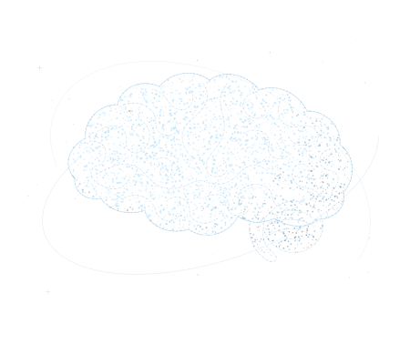

```{=html}
<div id="zm-constellation">
  <div class="zm-main">

    <section class="zm-hero" aria-labelledby="zm-research-title">
      <div class="zm-intro">
        <p class="zm-eyebrow">Cognitive neuroscience · Research software</p>
        <h1 id="zm-research-title">Making FPVS<br>easier to use.</h1>
        <p class="zm-lead">I build tools for designing visual experiments and analyzing EEG data, with a focus on making Fast Periodic Visual Stimulation more accessible.</p>
        <div class="zm-actions">
          <a class="zm-primary" href="research.html">Explore my research <span aria-hidden="true">↗</span></a>
          <a class="zm-text-link" href="software.html">View software <span aria-hidden="true">→</span></a>
        </div>
        <div class="zm-profile">
          
          <div><strong>Zack Murphy</strong><p>Biomedical Engineering PhD student<br>Mississippi State University</p></div>
        </div>
      </div>
      <div class="zm-art" aria-label="Brain constellation artwork">
        <div class="zm-art-trigger">
          
          <canvas class="zm-brain" aria-hidden="true"></canvas>
          <button type="button" class="zm-motion" data-brain-motion aria-label="Pause star motion" hidden><span class="zm-motion-icon" aria-hidden="true"></span></button>
        </div>
      </div>
    </section>
    <section class="zm-work" aria-labelledby="zm-work-title">
      <div class="zm-section-heading"><h2 id="zm-work-title">Selected work</h2><a href="software.html">All software <span aria-hidden="true">↗</span></a></div>
      <div class="zm-work-layout">
        <div class="zm-tools">
          <a class="zm-tool" href="fpvs-studio.html">
            
            <div><h3>FPVS Studio</h3><p>Design and run FPVS experiments.</p></div><span class="zm-go" aria-hidden="true">↗</span>
          </a>
          <a class="zm-tool" href="fpvs-toolbox.html">
            
            <div><h3>FPVS Toolbox</h3><p>Process EEG data and create figures.</p></div><span class="zm-go" aria-hidden="true">↗</span>
          </a>
        </div>
        <article class="zm-paper">
          <p class="zm-paper-meta">Latest publication · 2026</p>
          <h3><a href="publications.html#exploring-brain-activity-in-novice-athletes-during-closed-and-open-skills-in-table-tennis">Exploring Brain Activity in Novice Athletes During Closed and Open Skills in Table Tennis</a></h3>
          <p class="zm-journal">Journal of Motor Behavior</p>
          <a class="zm-text-link" href="https://doi.org/10.1080/00222895.2026.2691791" target="_blank" rel="noopener">Read the paper <span aria-hidden="true">↗</span></a>
        </article>
      </div>
    </section>
    <section class="zm-learning" aria-labelledby="zm-learn-title">
      <div><h2 id="zm-learn-title">New to FPVS?</h2><p>A practical guide to the method, experiment design, and data analysis.</p></div>
      <a class="zm-text-link" href="learn-fpvs/what-is-fpvs.html">Start learning <span aria-hidden="true">→</span></a>
    </section>
  </div>
</div>
```
