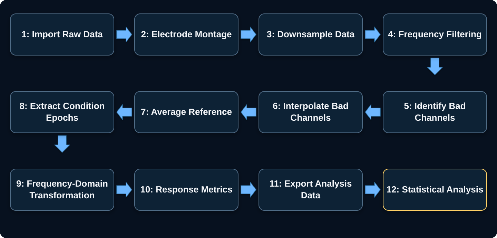

This guide is currently under development. Please check back later for updates.

The interactive figure below summarizes a typical FPVS EEG processing and response-quantification workflow. Select any step to open its dedicated page.

<figure class="fpvs-method-figure fpvs-analysis-figure">

  <figcaption>
    Example FPVS EEG analysis workflow. Specific preprocessing choices should be adapted to the recording system, study design, and prespecified analysis plan. On smaller screens, scroll the diagram horizontally or <a href="../assets/figures/fpvs-analysis-workflow.svg">view it full size</a>.
  </figcaption>
</figure>
