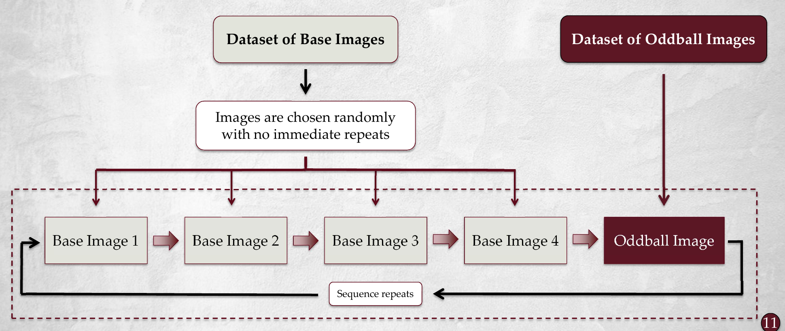

## Overview

Fast Periodic Visual Stimulation (FPVS) is a powerful method that can elicit strong neural responses to stimuli in just a few minutes of recording time. This method is non-invasive, requires no active participation from the participant, and has been used to study a wide range cognitive processes in the brain from facial expression processing, memory, anxiety, semantic categorization, and more using [electroencephalography](https://www.ncbi.nlm.nih.gov/books/NBK390346/){target="_blank"} (EEG).

In a typical FPVS experiment, stimuli (usually images or, [in some studies, words](https://pubmed.ncbi.nlm.nih.gov/39708534/){target="_blank"}) are presented on screen to a participant at a fast rate (e.g., 6 Hz, or six times per second). The participant's brain activity is recorded using EEG, and the resulting data is analyzed to study the neural responses to the stimuli.

<figure class="fpvs-method-figure">
  
  <figcaption>
    Example FPVS oddball sequence. Four base images are followed by one oddball image, and the sequence repeats. <a href="../assets/figures/fpvs-oddball-sequence.webp">View the full-size diagram</a>.
  </figcaption>
</figure>

Many FPVS studies have demonstrated that meaningful responses can be measured in less than two minutes of recording time, offering a significant advantage over other EEG methods that require recording times of over an hour.

## Why use FPVS?

FPVS combined with EEG offers several important advantages over current EEG techniques. First, when compared with traditional EEG methodology such as event-related potentials (ERPs), FPVS can elicit strong neural responses in a fraction of the time. Second, unlike ERP based methods, FPVS can be sensitive on the level of the individual, which provides future opportunity for use in a clinical setting to aid in the detection and diagnosis of various cognitive conditions. Finally, when compared with other neuroimaging methods such as fMRI or PET scans, FPVS and EEG is comparatively inexpensive, portable, and can be used in a wider range of populations and locations.

## The "Oddball" Paradigm

To elicit strong neural responses, many FPVS experiments use what's called an "oddball" paradigm.

In this design, a base stimulus is presented at a fixed rate (say, six times per second, or 6 Hz), and a different stimulus is presented within that visual stream at a less frequent rate (say, once every five stimuli, or 1.2 Hz). If the brain detects a difference between the base stimuli and the oddball stimuli, a neural response will be detectable exactly at the oddball freuqency (1.2 Hz in this example) and its frequency harmonics (2.4 Hz, 3.6 Hz, etc). This response can then be measured using EEG.

Because the response to the oddball stimuli is known prior to the start of the study, we can transform the time series data into the frequency domain using a Fourier transform and extract the signal found at the oddball frequency. This design provides a relatively straightforward way to quantify this response and to compare it across participants, experimental conditions, and groups.

## What this guide covers

This guide will cover key FPVS concepts and terminology that are important to understanding the advantages and limitations of FPVS. It will also provide a brief overview of the FPVS workflow, including how to design an FPVS experiment, how to analyze FPVS data, and how to interpret the results. Finally, this guide will provide a list of suggested readings for those who want to learn more about FPVS and its applications in cognitive neuroscience research.
